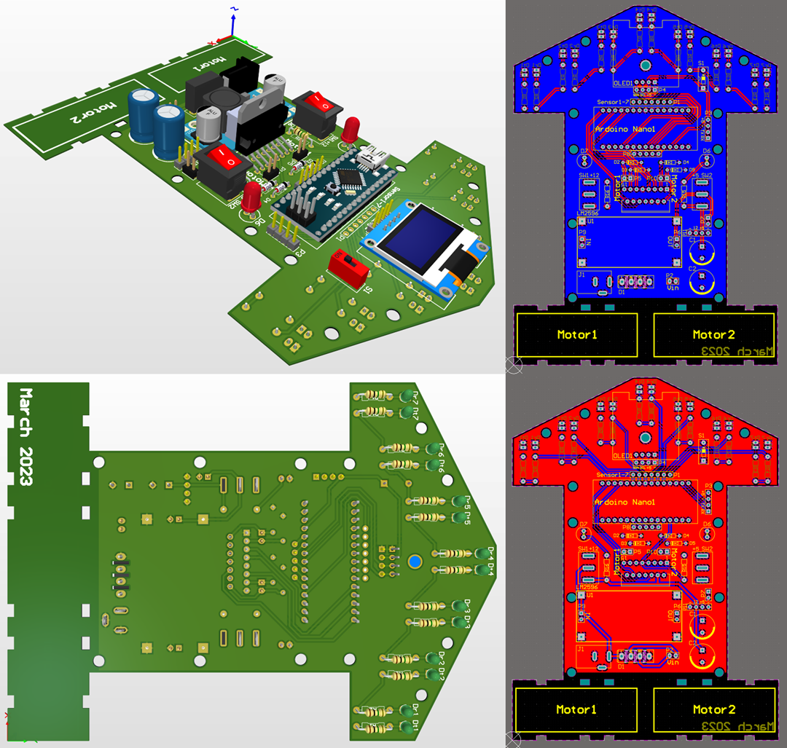
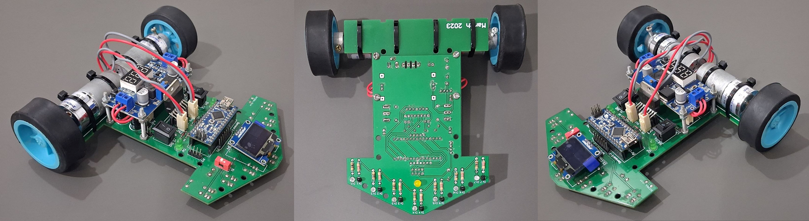

# Robotics Course Term 1

## Final Robot

## Table of Contents

- [About](#about)
- [Getting Started](#getting_started)
- [Usage](#usage)

## About ``

In the first semester of introductory robotics, students get to know the basics of robotics and how robots work at a basic level.
Arduino IDE and C++ language are used in this course.
Each week is related to setting up different components of a robot and setting up different modules and sensors.
And finally, the final project of the course includes designing the PCB of the robot and programming the router robot.

## Getting Started ``

### Prerequisites

You need to know C++ programming at least at an introductory level.` `
To understand the circuits, it is better to know a little electronics, although the circuits are simple and the projects are modular.` `
After that you need to install Arduino IDE.

### Installing

Download and install [Arduino IDE v2](https://www.arduino.cc/en/software). It's C++ IDE for Arduino, ESP, ... boards.` `
Download and install [Altium Designer](https://soft98.ir/software/engineering/3575-%D8%AF%D8%A7%D9%86%D9%84%D9%88%D8%AF-%D8%A2%D9%84%D8%AA%DB%8C%D9%88%D9%85-%D8%AF%DB%8C%D8%B2%D8%A7%DB%8C%D9%86%D8%B1.html) for design your robot's PCB.

## Usage ``

First, it is better to read the slides in the slide folder of each week.` `
Next, close the circuit from the Russian circuit schematic in the files folder in each week.` `
Finally, upload the code to Arduino and test the circuit. Be sure to try to understand the codes yourself and even change them a little.` `
Go ahead!
